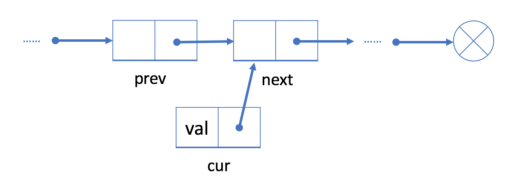
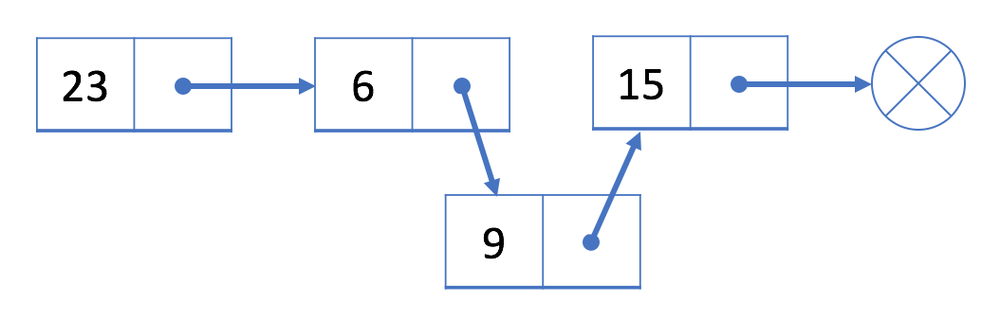

# Linked Lists

Similar to the array, the linked list is also a linear data structure. Here is an example:


As you can see, each element in the linked list is actually a separate object while all the objects are **linked together by the reference field** in each element.

There are two types of linked list: singly linked list and doubly linked list. The example above is a singly linked list and here is an example of doubly linked list:


## Singly Linked List

Here is the typical definition of a node in a singly-linked list:

### Node Structure
```java
// Definition for singly-linked list.
public class SinglyListNode {
    int val;
    SinglyListNode next;
    SinglyListNode(int x) { val = x; }
}
```
In most cases, we will use the head node (the first node) to represent the whole list.

### Operations
Unlike the array, we are not able to access a random element in a singly-linked list in constant time. If we want to get the ith element, we have to traverse from the head node one by one. It takes us **O(N) time on average to visit an element by index**, where N is the length of the linked list.

For instance, in the example above, the head is the node 23. The only way to visit the 3rd node is to use the "next" field of the head node to get to the 2nd node (node 6); Then with the "next" field of node 6, we are able to visit the 3rd node.

You might wonder why the linked list is useful though it has such a bad performance (compared to the array) in accessing data by index. We will introduce the insert and delete operations in next two articles and you will realize the benefit of the linked list.

#### Add Operation
If we want to add a new value after a given node prev, we should: 

1. Initialize a new node cur with the given value;


2. Link the "next" field of cur to prev's next node next;



3. Link the "next" field in prev to cur.


Unlike an array, we don’t need to move all elements past the inserted element. Therefore, you can insert a new node into a linked list in O(1) time complexity, which is very efficient.

**An Example**


Let's insert a new value 9 after the second node 6.

We will first initialize a new node with value 9. Then link node 9 to node 15. Finally, link node 6 to node 9.

After insertion, our linked list will look like this:



#### Add a Node at the Beginning
As we know, we use the head node head to represent the whole list.

So it is essential to update head when adding a new node at the beginning of the list.

1. Initialize a new node cur;
2. Link the new node to our original head node head.
3. Assign cur to head.
For example, let's add a new node 9 at the beginning of the list.

1. We initialize a new node 9 and link node 9 to current head node 23.


2. Assign node 9 to be our new head.


